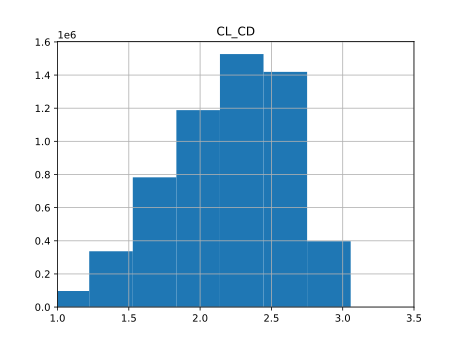

The created datasets can be found in [this link.](https://drive.google.com/drive/folders/1giPf-ObGBRs5VrpVfjaEJ05oiv5svsFQ?usp=sharing)

## 390k sample gaussian generated dataset

## grid size 5 uniform generated dataset

## grid size 5 uniform generated dataset downsampled

## grid size 6 uniform generated dataset

## grid size 6 uniform generated dataset downsampled

## grid size 7 uniform generated dataset
 will be added soon.
## grid size 7 uniform generated dataset downsampled
 will be added soon.