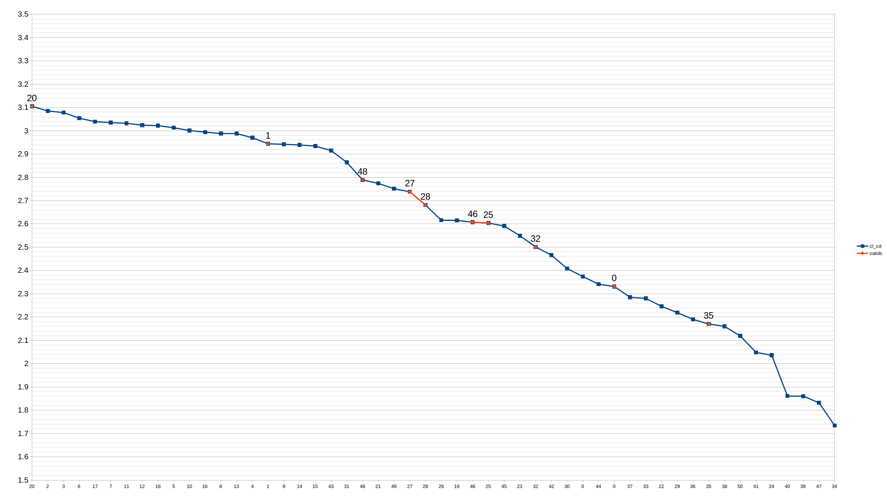
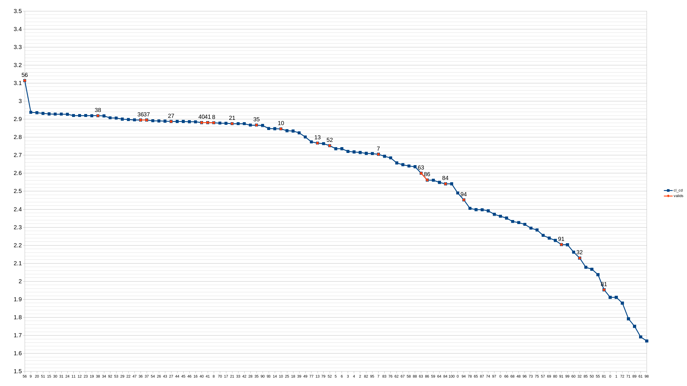
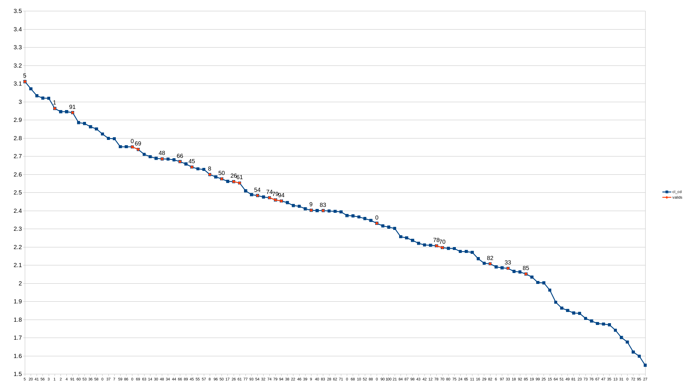
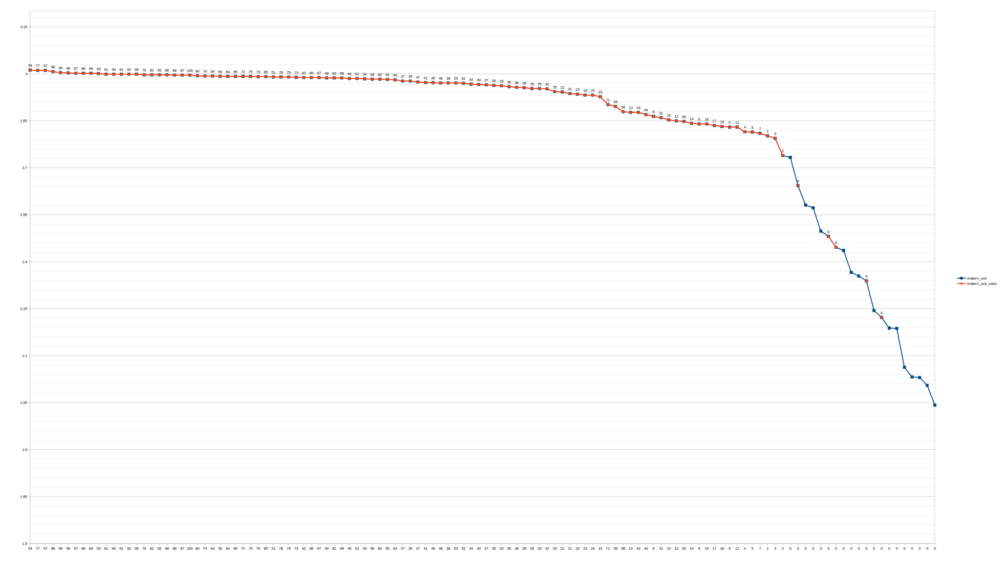
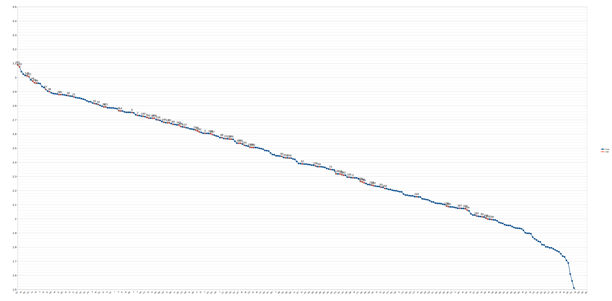
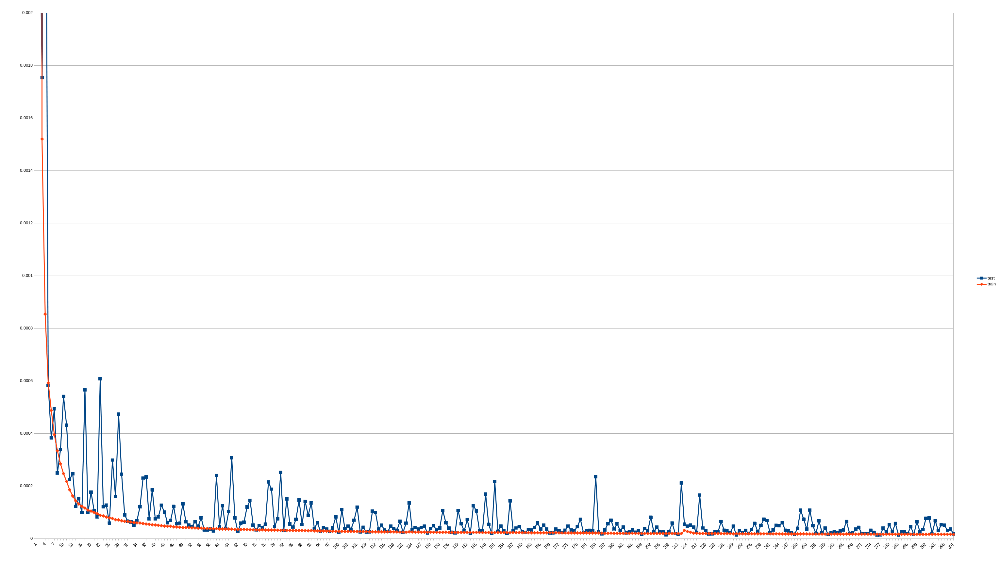
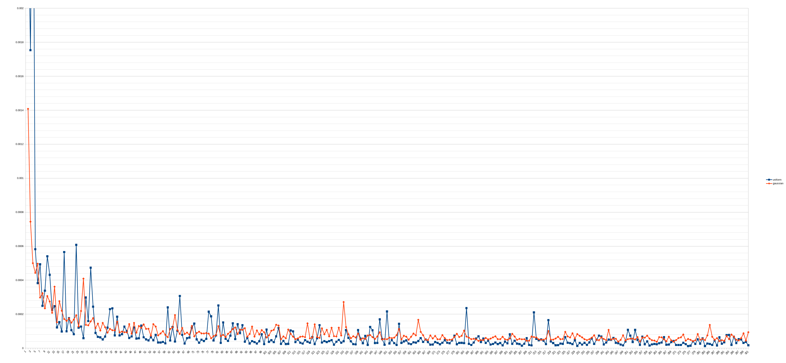
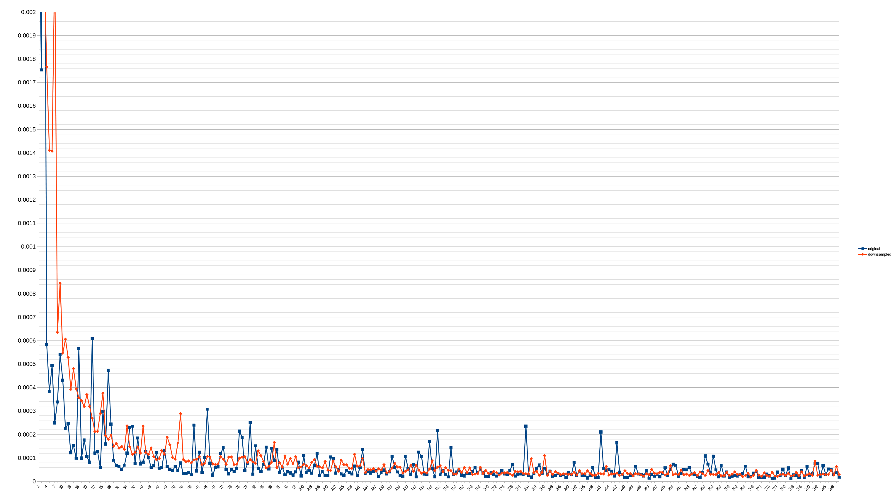
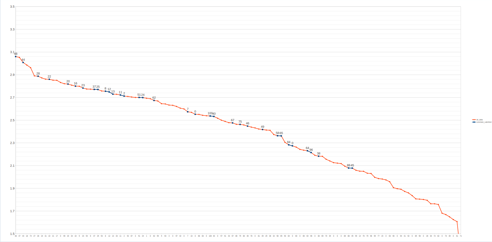
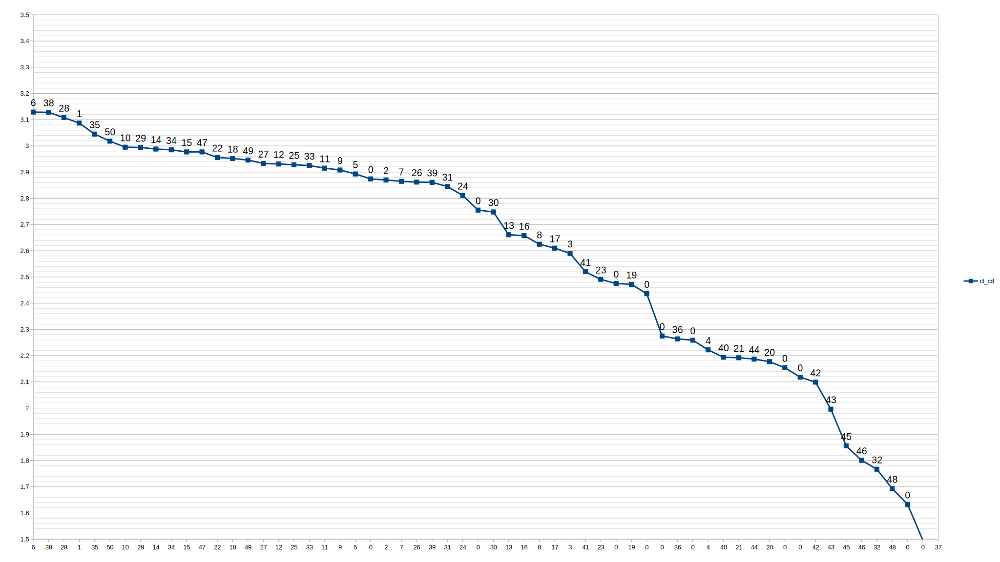

# BoTorch-optim
## Getting Started
* Minimum python version 3.7
* Required packages listed below
```
pip install botorch
pip install ax-platform
pip install numpy
```
## What's done
### Transfer learning DNN enhanced BO
The best models used in transfer learning has implemented with BO to observe if we could achieve better results. The results for both downsampled dataset and normal dataset trained models can be seen below.

The same code for DNNBO can be used for this as well. However, we need to change model_loc parameter to the transfer learned model.

With transfer learning the non-downsampled model could achieve **CL_CD=3.105** in **20 iterations**, and the downsampled model could achieve **CL_CD=3.114** in **56 iterations**.

DNN-BO with transfer learning non-downsampled model


DNN-BO with transfer learning downsampled model

### Transfer Learning of DNN
Since high fidelity simulations are hard, we have gathered few samples (50 samples) using a high fidelity simulation and used transfer learning techniques to the previously trained DNN. It achieved **0.00048** MSE over the high fidelity data.

To run transfer learning code:
```
For mlp:
    python3.7 mlp-transfer.py

For Qres:
    python3.7 qres-transfer.py

    optional arguments:
        -h, --help            show this help message and exit
        --dataset_loc1 [DATASET_LOC1 [DATASET_LOC1 ...]]
                                The location of the datasets to be used. If multiple
                                given it will try all possiblities. The dataset
                                location is
                                "datasets_transfer/dataset_{dataset_loc1}.csv".
                                Default: "uniform"
        --model_loc [MODEL_LOC]
                                The location of the model to be used. Default:
                                "model_0_[100, 50, 20, 10,
                                10]_uniform_downsampled_point2binsize.pt"
        --model_layers [MODEL_LAYERS [MODEL_LAYERS ...]]
                                Layer configuration of the model. Ex: 100 50 20 10 10 for MLP 100 4 for Qres.
                                Default: 100 50 20 10 10 for MLP 100 4 for Qres
        --init [INIT [INIT ...]]
                                True means it will reinitialize last layer. If
                                multiple given it will try all possiblities. Ex.
                                --init True False. Default False
        --train_last [TRAIN_LAST [TRAIN_LAST ...]]
                                True means it will only train the last layer. If
                                multiple given it will try all possiblities. Ex:
                                --train_last True False. Default: False
```
### Using DNN enhanced BO with CFD like simulation
The best DNN model is implemented to BO. I have tried UCB and EI as acquisiton functions. The regression results can be seen below. X-axis represents the iteration count and y-axis represents the best CL/CD until that iteration. Blue points are the points that follow the constraints and the others are points that did not satisfy the constraints. 

To run DNNBO code:
```
python botorch-datcom-constraint-dnn.py

optional arguments:
  -h, --help            show this help message and exit
  --model_loc [MODEL_LOC]
                        The location of the model to be used. Default:
                        "model_all_uniform.pt"
  --qres                If model is a qres model, this should be given.
  --model_layers [MODEL_LAYERS [MODEL_LAYERS ...]]
                        Layer configuration of the model. Ex: 100 50 20 10 10
                        for MLP and 100 4 for qres Default: 100 50 20 10 10
  --grid                If given, grid search for optimal hyperparameter will
                        be done.
  --mean MEAN           "zero" for zero mean, and "constant" for constant
                        mean. Default is zero. If grid serach will be done,
                        this has no effect.
  --init INIT           Number of initial data points. Default is 5. If grid
                        serach will be done, this has no effect.
  --matern              If given, matern kernel will be used. If grid serach
                        will be done, this has no effect.
  --UCB                 If given, upper confidence bound acqf will be used.
                        Otherwise, expected improvement will be used. If grid
                        serach will be done, this has no effect.
```

The DNN enhanced BO with EI could achieve **CL_CD=3.112** in **5 Trials**. Whereas, Classical BO needed **more than 100 iterations** to achieve **CL_CD=3.09**.

DNN-BO with EI acquisition function


DNN-BO with UCB acquisition function


For comparison the same regression without DNN can be seen below. 

### DNN training
A DNN is trained with both datasets, several layer configuration, and several regularization coefficient. The search space can be seen below.
```
DNN type =  QResNet, MLP
regularization parameters = 0, 1e-7, 1e-6, 1e-5, 1e-4
layers =    [100,50,20,10],
            [100,50,20,10,10],
            [100,50,20,10,10,10]
dataset =   uniform, gaussian, uniform_downsampled
```
To run training code:
```
For mlp:
    python mlp.py

    optional arguments:
    -h, --help            show this help message and exit
    --dataset_loc1 [DATASET_LOC1 [DATASET_LOC1 ...]]
                            The location of the datasets to be used. The dataset
                            location is "datasets6/dataset_{dataset_loc1}.csv".
                            Default: "uniform_downsampled_point2binsize"

For QresNet:
    python3.7 qres.py 

        optional arguments:
        -h, --help            show this help message and exit
        --dataset_loc1 [DATASET_LOC1 [DATASET_LOC1 ...]]
                                The location of the datasets to be used. The dataset
                                location is "datasets6/dataset_{dataset_loc1}.csv".
                                Default: "uniform_downsampled_point2binsize"
        --layers [LAYERS [LAYERS ...]]
                                Layer size to be used. Default is 100 4. Which means
                                100 neurons for 4 layers.

```
The best model was MLP with regularization=0, layers=[100,50,20,10,10], dataset=uniform. \
It achieved **2.606e-3** mean squared error(MSE) in the first batch, and **1.224e-5** MSE at best. Its training vs test plot can be seen below. The blue line represents the test error, and the red line represents the training error.


In the comparison, the uniform dataset performed better. The best MSE of gaussian dataset was **3.760e-5**. Whereas, the best MSE of uniform dataset was **1.224e-5**. A comparison plot can be seen below. The blue line represents uniform dataset model, and the red line represents gaussian dataset model.


The downsampled dataset was not bad also. The best MSE of downsampled dataset was **1.836e-5**. A comparison plot can be seen below.

### Dataset Creation for DNN enhanced BO
We have considered 2 methods to create a dataset for training the neural network. One of the methods is grid size sampling of the search space. The other method is gaussian sampling. We have created datasets using both methods. The code for creating them can be seen below.
```
For gaussian dataset generation:
    python datcom-dataset-creation.py
    
For uniform dataset generation:
    python datcom-dataset-creation-uniform.py

For downsampling a dataset:
    python downsample.py 

    positional arguments:
        dataset_loc  The location of the dataset to be used. Default:
                    "datasets6/dataset_uniform"

For combining the results and see the histograms:
    python histogram.py
```
The CL_CD distributions of these datasets and their drive links can be seen [here](Dataset-generation/README.md).

### DATCOM optimization with constraints
The optimization loop used to optimize the DATCOM simulation results. This part requires a python package for DATCOM GYM environment and DATCOM simulation program.
```
python botorch-datcom-constraint.py

optional arguments:
  -h, --help  show this help message and exit
  --transfer  To run without altered parameters. Default is with altered
              parameters
  --grid      To run grid search
```
The first section in the python file provides an interface to change the number of simulations run for the optimization. They can be changed. We have used 20 initial points with 100 iterations for this results.

When the optimizations finish, the last lines will be the optimum parameters, its corresponding CL/CD value with CD and XCP values. An example output can be seen below.
```
Parameters: 

{'CHORD1_1': 0.4,
 'CHORD1_2': 0.0,
 'CHORD2_1': 0.24760313891904054,
 'CHORD2_2': 0.25,
 'SSPAN1_2': 0.23575387674501522,
 'SSPAN2_2': 0.23012849856492681,
 'XLE1': 1.25,
 'XLE2': 3.0}
Best CL/CD: 3.06
CD: 0.446
XCP: 0.58922
```
The regression results can be seen below. X-axis represents the iteration count and y-axis represents the best CL/CD until that iteration. Blue points are the points that follow the constraints and the others are points that did not satisfy the constraints.

### BoTorch-Test-constraint
A test function, namely branin function, is used for testing multi output models and constraint problems.
```
python botorch-test-constaint.py
```
The optimization problem for the brainin function is global minimization with a constraint that the square of the output should be larger than 0.25. Since the function has a minimum of 0.39 and it is continuous, the expected value to be found is around 0.5 to satisfy the constraint. An example output can be seen below.
```
{'x1': 3.2713186288248473, 'x2': 1.9938765060179522} 0.5117414287575023
```

### DATCOM optimizasiton
The optimization loop used to optimize the DATCOM simulation results. This part requires a python package for DATCOM GYM environment and DATCOM simulation program.
```
python botorch_datcom.py

optional arguments:
  -h, --help  show this help message and exit
  --transfer  To run without altered parameters. Default is with altered
              parameters
```
The first section in the python file provides an interface to change the number of simulations run for the optimization. They can be changed. We have used 10 initial points with 50 iterations for this results.

When the optimizations finish, the last lines will be the optimum parameters, its corresponding CL/CD value. An example output can be seen below.
```
Parameters: 

{'CHORD1_1': 0.2897263827978134,
 'CHORD1_2': 0.06396360639938851,
 'CHORD2_1': 0.25027315271704553,
 'CHORD2_2': 0.25,
 'SSPAN1_2': 0.3,
 'SSPAN2_2': 0.3,
 'XLE1': 1.313159746244171,
 'XLE2': 3.0131620664460073}
Best CL/CD: 3.129
```
Results can be seen below.X-axis represents the iteration count and y-axis represents the best CL/CD until that iteration.

### BoTorch-Test
A test function, namely branin function, is used for testing and understanding the botorch package.
```
python botorch-test.py
```
The optimization problem for the brainin function is global minimization. There are 3 global minimum points with value 0.397887. The points for this value can be seen below:
```
(x1 = -π, x2 = 12.275)
(x1 = π, x2 = 2.275)
(x1 = 9.42478, x2 = 2.475)
```
The expected output of this test code is a coordinate close to either of these 3 points with a value close to the minimum value 0.397887. An example output can be seen below.
```
{'x1': 9.438115740365452, 'x2': 2.5624387804768207} 0.40454255786889665
```
