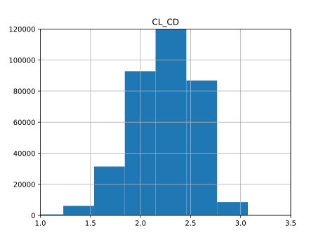
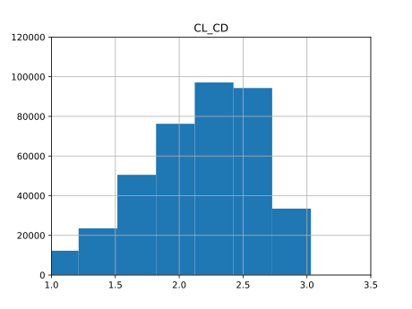
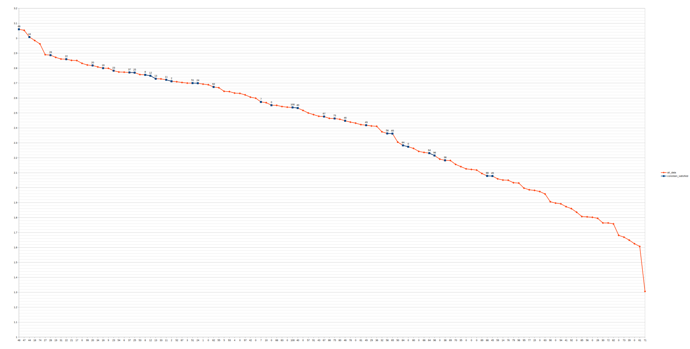
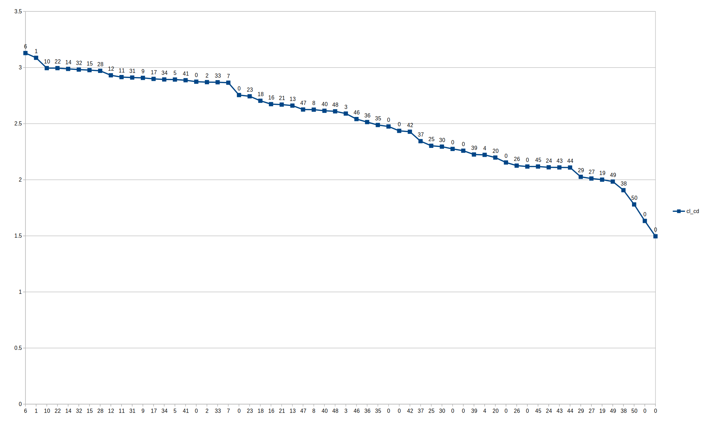

# BoTorch-optim
## Getting Started
* Minimum python version 3.7
* Required packages listed below
```
pip install botorch
pip install ax-platform
pip install numpy
```
## What's done
### Dataset Creation for DNN enhanced BO
We have considered 2 methods to create a dataset for training the neural network. One of the methods is grid size sampling of the search space. The other method is gaussian sampling. We have created datasets using both methods. The code for creating them can be seen below.
```
For gaussian dataset generation:
    python datcom-dataset-creation.py
    
For uniform dataset generation:
    python datcom-dataset-creation-uniform.py

For combining the results and see the histograms:
    python histogram.py
```
The CL_CD distributions of these datasets can be seen below.

Gaussian distribution result:



Uniform distribution result:


### DATCOM optimization with constraints
The optimization loop used to optimize the DATCOM simulation results. This part requires a python package for DATCOM GYM environment and DATCOM simulation program.
```
python botorch-datcom-constraint.py
```
The first section in the python file provides an interface to change the number of simulations run for the optimization. They can be changed. We have used 20 initial points with 100 iterations for this results.

When the optimizations finish, the last lines will be the optimum parameters, its corresponding CL/CD value with CD and XCP values. An example output can be seen below.
```
Parameters: 

{'CHORD1_1': 0.4,
 'CHORD1_2': 0.0,
 'CHORD2_1': 0.24760313891904054,
 'CHORD2_2': 0.25,
 'SSPAN1_2': 0.23575387674501522,
 'SSPAN2_2': 0.23012849856492681,
 'XLE1': 1.25,
 'XLE2': 3.0}
Best CL/CD: 3.06
CD: 0.446
XCP: 0.58922

```
The regression results can be seen below. X-axis represents the iteration count and y-axis represents the best CL/CD until that iteration. Blue points are the points that follow the constraints and the others are points that did not satisfy the constraints.

### BoTorch-Test-constraint
A test function, namely branin function, is used for testing multi output models and constraint problems.
```
python botorch-test-constaint.py
```
The optimization problem for the brainin function is global minimization with a constraint that the square of the output should be larger than 0.25. Since the function has a minimum of 0.39 and it is continuous, the expected value to be found is around 0.5 to satisfy the constraint. An example output can be seen below.
```
{'x1': 3.2713186288248473, 'x2': 1.9938765060179522} 0.5117414287575023
```

### DATCOM optimizasiton
The optimization loop used to optimize the DATCOM simulation results. This part requires a python package for DATCOM GYM environment and DATCOM simulation program.
```
python botorch_datcom.py
```
The first section in the python file provides an interface to change the number of simulations run for the optimization. They can be changed. We have used 10 initial points with 50 iterations for this results.

When the optimizations finish, the last lines will be the optimum parameters, its corresponding CL/CD value. An example output can be seen below.
```
Parameters: 

{'CHORD1_1': 0.2897263827978134,
 'CHORD1_2': 0.06396360639938851,
 'CHORD2_1': 0.25027315271704553,
 'CHORD2_2': 0.25,
 'SSPAN1_2': 0.3,
 'SSPAN2_2': 0.3,
 'XLE1': 1.313159746244171,
 'XLE2': 3.0131620664460073}
Best CL/CD: 3.129
```
Results can be seen below.X-axis represents the iteration count and y-axis represents the best CL/CD until that iteration.

### BoTorch-Test
A test function, namely branin function, is used for testing and understanding the botorch package.
```
python botorch-test.py
```
The optimization problem for the brainin function is global minimization. There are 3 global minimum points with value 0.397887. The points for this value can be seen below:
```
(x1 = -π, x2 = 12.275)
(x1 = π, x2 = 2.275)
(x1 = 9.42478, x2 = 2.475)
```
The expected output of this test code is a coordinate close to either of these 3 points with a value close to the minimum value 0.397887. An example output can be seen below.
```
{'x1': 9.438115740365452, 'x2': 2.5624387804768207} 0.40454255786889665
```
